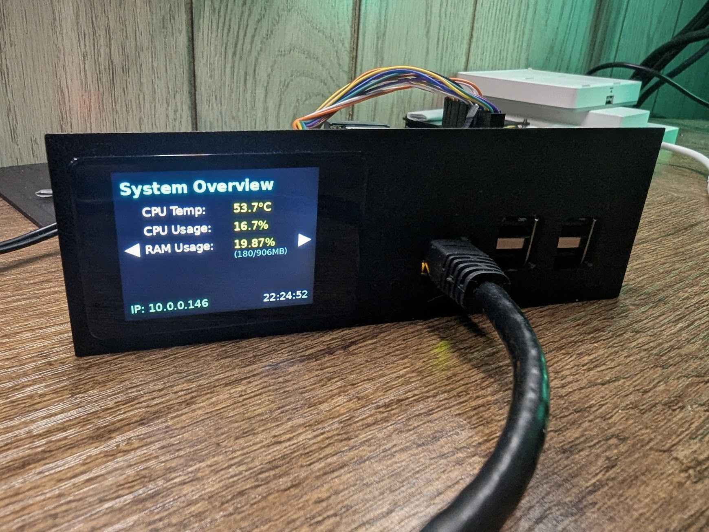

# **Pi-Monitor: A UniFi-Inspired System Monitor**

A responsive, touchscreen system monitor for headless Raspberry Pi servers, designed to provide at-a-glance status information with an aesthetic inspired by Ubiquiti UniFi hardware.



## **Overview**

This project provides a clean, simple, and extensible monitoring interface for a Raspberry Pi. The inspiration comes from the small touchscreens found on certain UniFi gateways and switches, which offer convenient access to core system metrics.

The goal is to create a polished hardware and software experience for headless servers. Housed in a custom 1U rack-mountable enclosure and powered over Ethernet, a Pi running this software becomes a self-contained, single-cable appliance with its own status and control display.

This is ideal for home labs, small businesses, or anyone who wants to add a professional touch to their Raspberry Pi projects.

## **Hardware Requirements**

While the software is designed to be adaptable, it has been developed and tested with the following components:

* **Raspberry Pi:** Developed for a Pi 5, tested on a Pi 3\. Should be compatible with any Pi model that has the standard 40-pin GPIO header.  
* **Display:** [Waveshare 2inch Capacitive Touch LCD](https://www.waveshare.com/wiki/2inch_Capacitive_Touch_LCD) (320x240 resolution and usually quite affordable)  
* **Power/Storage (Optional but Recommended):** [Waveshare PoE M.2 HAT+ (B)](https://www.google.com/search?q=https://www.waveshare.com/wiki/PoE_M.2_HAT%2B_\(B\)). This hat is an excellent choice as it provides Power over Ethernet (PoE), an NVMe slot for fast storage, and still passes through all the necessary GPIO pins for the display.

## **Features**

### **Current Features**

* Multi-page, swipeable interface.  
* Real-time display of key system metrics:  
  * CPU Temperature & Usage  
  * RAM Usage  
  * Disk Space Usage  
  * IP Address  
* Automatic screen sleep after a period of inactivity, with wake-on-touch.

### **Planned Features**

* **3D Printed Enclosure:** Release of STL files for a 1U rack-mountable enclosure that houses the Pi and display.  
* **External Event Triggers:** The display will activate and show persistent alerts for critical events (e.g., a NUT warning that a monitored UPS is on battery).  
* **Enhanced Interactivity:**  
  * Safe Reboot & Shutdown buttons.  
  * User-configurable buttons to execute custom shell scripts (e.g., `docker restart <container>`).  
* **Customization:**  
  * Ability to display a custom logo.  
  * Option to set a logo as a desaturated wallpaper behind the data.  
* **Early Boot Display:** Investigate the possibility of initializing the display as early as possible in the boot process to show boot logs or status.  
* **Display Sync:** A "far future" goal to allow multiple pi-monitor units in a rack to have their screens activated and navigated simultaneously.

## **Installation Guide**

These instructions assume you are starting with a fresh installation of Raspberry Pi OS **Lite (64-bit)**.

### **1\. Initial OS Setup & Updates**

First, ensure your system is up to date.

```bash
sudo apt update && sudo apt upgrade -y
```

### **2\. Install Core Dependencies**

We need `git` to clone the repository and the `python3` packages for creating our isolated Python environment and enabling headers. 

We use the `gpiozero` Python library. This performs best with `lgpio`, which depends on `libgpiod2`.

```bash
sudo apt install -y git python3 python3-dev python3-venv libgpiod2
```

### **3\. Enable Hardware Interfaces**

The display uses SPI and the touch controller uses I2C. Enable them using the Raspberry Pi configuration tool.

```bash
sudo raspi-config
```

Navigate to 3 Interface Options and enable I2C and SPI.

After this, reboot the Pi to ensure all changes take effect.

```bash
sudo reboot
```

### **4\. Clone and Set Up the Project**

Once the Pi has rebooted, log back in and run the following commands.

```bash
# Clone the repository from GitHub  
git clone https://github.com/puckawayjeff/pi-monitor.git

# Navigate into the project directory  
cd pi-monitor

# Create a Python virtual environment  
python3 -m venv venv

# Activate the virtual environment  
source venv/bin/activate

# Install the required Python packages  
pip install -r requirements.txt
```

**Note:** To leave the virtual environment at any time, simply type `deactivate`. Remember to re-run `source venv/bin/activate` before running the app again.

## **Running the Application**

With your virtual environment active, run the main script:

```bash
python3 main.py
```

The monitor should initialize and display the first screen. To stop the application, press `Ctrl+C`.

## **Configuration (`config.yaml`)**

The layout and content of the monitor are controlled by the `config.yaml` file. This allows you to easily customize what information is displayed, change fonts, and reorder items without modifying the Python source code.

The configuration is split into three main sections: `colors`, `fonts`, and `screens`.

### **Colors**

The `colors` section defines the color palette for the UI. You can use standard color names (e.g., `"WHITE"`) or hex codes (e.g., `"#c29b4a"`).
- `title_background`: Background color of the top title bar.
- `title_text`: Default text color for screen titles.
- `content_background`: Background color for the main content area.
- `widget_default`: Default text color for all widgets. This can be overridden by a widget's individual color property.
- `nav_buttons`: Color of the left/right navigation arrows in the title bar.

### **Fonts**

The `fonts` section defines the font styles used by the widgets. You can define multiple fonts and refer to them by name (e.g., `large`, `medium`) in your widget configurations.

The `path` property should be the filename of a `.ttf` or `.otf` font file. All custom font files should be placed in the `assets/fonts/` directory.

### **Available Data Sources**

Each screen is composed of `widgets`. Widgets use the `data_source` property to fetch live system information. You can use any of the following built-in functions as a value for `data_source`.

| Function Name           | Returns                                                                 | Example Output                  | Widget Compatibility      |
| ----------------------- | ----------------------------------------------------------------------- | ------------------------------- | ------------------------- |
| `get_cpu_temperature`   | A single string with the CPU temperature.                               | `"45.1°C"`                      | `line_item`, `dynamic_text` |
| `get_cpu_usage`         | A single string with the current CPU usage percentage.                  | `"15.7%"`                       | `line_item`, `dynamic_text` |
| `get_ram_info`          | Two strings: the usage percentage and a `used/total` summary.           | `("25.4%", "1001/3944MB")`       | `line_item_with_sub`      |
| `get_disk_space`        | Two strings: the usage percentage and a `used/total` summary for root.  | `("68.2%", "19.8G/29.1G")`       | `line_item_with_sub`      |
| `get_ip_address`        | A single string with the primary IPv4 address.                          | `"192.168.1.10"`                | `line_item`, `dynamic_text` |
| `get_current_time`      | A single string with the current time.                                  | `"22:10:45"`                    | `static_text`             |

### **Widget Types**

The `type` property of a widget in `config.yaml` determines how it is rendered and what other properties it requires.

#### `line_item`
Displays a `label` and a value on the same line. Expects a `data_source` that returns a single value.
- **`position`**: `[x, y]` coordinates for the label's top-left corner.
- **`label`**: The text to display.
- **`data_source`**: A function name from the table above that returns a single string.
- **`data_x_offset`**: The horizontal distance (in pixels) from the start of the label to the start of the data value.
- **`font`** (optional): The font name defined in the `fonts` section. Defaults to `medium`.
- **`color`** (optional): The text color. Defaults to `colors.widget_default`.

#### `line_item_with_sub`
Similar to `line_item`, but for a `data_source` that returns two values (e.g., `get_ram_info`). It displays the second value as smaller sub-text below the first.
- **`position`**, **`label`**, **`data_source`**, **`data_x_offset`**, **`font`**, **`color`**: Same as `line_item`.
- **`data_source`**: Must be a function that returns two values.
- **`sub_font`** (optional): The font for the sub-text. Defaults to `small`.
- **`sub_color`** (optional): The color for the sub-text. Defaults to `GRAY`.
- **`sub_y_offset`** (optional): The vertical distance (in pixels) from the main data value to the sub-text.

#### `dynamic_text`
Displays text from a `template` string, where `{data}` is replaced by the value from the `data_source`.
- **`position`**: `[x, y]` coordinates for the text's top-left corner.
- **`template`**: A string containing `{data}` as a placeholder.
- **`data_source`**: A function name from the table above.
- **`font`** (optional): The font name.
- **`color`** (optional): The text color.

#### `static_text`
Displays a value directly from a `data_source` without any label or template. Useful for things like the clock.
- **`position`**: `[x, y]` coordinates for the text's top-left corner.
- **`data_source`**: A function name from the table above.
- **`font`** (optional): The font name.
- **`color`** (optional): The text color.

## **Contributing**

TBD. Not expecting any interest at this point, honestly. Surprise me!

## **License**

This project is licensed under the Creative Commons Attribution-NonCommercial 4.0 International License - see the LICENSE.md file for details.
